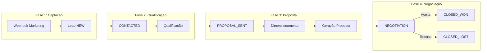

# 📋 Relatório de Análise AS-IS — Quarks OS

**Data:** 2026-02-05  
**Autor:** Análise Automatizada  
**Objetivo:** Estado atual completo do sistema, documentação consolidada, mapeamento de módulos, processos e fluxos

---

## 📑 Sumário Executivo

O **Quarks OS** é uma plataforma CRM + Proposta + Dimensionamento + Copilot IA para integradores de energia solar. O sistema está em desenvolvimento ativo com **7 features concluídas** e uma arquitetura **híbrida Node.js + Python** já implementada.

### Métricas Chave

| Indicador | Valor |
|-----------|-------|
| **Features concluídas** | 7/9 (100% das planejadas) |
| **Módulos frontend** | 9 rotas principais |
| **APIs backend** | 15+ endpoints |
| **Specs documentadas** | 9 especificações |
| **Cobertura documental** | 30+ documentos técnicos |

---

## 1. 🏗️ Arquitetura Atual

### 1.1 Stack Tecnológica

```
┌─────────────────────────────────────────────────────────────────┐
│                         FRONTEND                                │
│   React + Vite + Tailwind + Mantine + Recharts                 │
│   Design System: Petroleum/Solar tokens, Stitch compliance     │
│   Port: 5173 (dev)                                              │
└────────────────────────────┬────────────────────────────────────┘
                             │ HTTP/REST
┌────────────────────────────▼────────────────────────────────────┐
│                     BACKEND (NODE.JS)                           │
│   Express 5 + Prisma ORM + JWT Auth                            │
│   Maestro Orchestrator + Domain Agents                          │
│   Port: 3001                                                    │
└────────────────────────────┬────────────────────────────────────┘
                             │ HTTP/REST (interno)
┌────────────────────────────▼────────────────────────────────────┐
│                    CALC ENGINE (PYTHON)                         │
│   FastAPI + Pydantic + Prisma Client Python                    │
│   Cálculo, ROI, Tarifa, Proposta, Copilot, Visual Engine       │
│   Port: 8000                                                    │
└────────────────────────────┬────────────────────────────────────┘
                             │
┌────────────────────────────▼────────────────────────────────────┐
│                       POSTGRESQL                                │
│   Prisma Schema: 11 modelos principais                          │
│   Tabelas: users, leads, proposals, products, kits, etc.       │
└─────────────────────────────────────────────────────────────────┘
```

### 1.2 Camadas e Responsabilidades

| Camada | Tecnologia | Responsabilidade |
|--------|------------|------------------|
| **Frontend** | React + Vite + Tailwind | UI/UX, consumo de APIs, estados client-side |
| **Backend Node** | Express + Prisma | Gateway API, orquestração, autenticação, CRUD |
| **Calc Engine Python** | FastAPI + Prisma | Cálculos solares, ROI, proposta, Copilot multimodal |
| **Database** | PostgreSQL | Persistência de dados |
| **Externos** | Solar API (Google) | Dados de insight solar (não persistido) |

---

## 2. 📦 Mapeamento de Módulos

### 2.1 Módulos do Sistema (PRD v2.1)

| # | Módulo | Status | Implementação |
|---|--------|--------|---------------|
| 1 | **CRM Leads** | ✅ Parcial | Pipeline Kanban, LeadsPage, LeadDetailPage |
| 2 | **Proposta Interativa** | ✅ Parcial | Lista/detalhe/PDF/vista pública (spec 09) |
| 3 | **Simulador Solar** | ❌ Não | Planejado |
| 4 | **Kit Builder** | ❌ Não | Planejado |
| 5 | **Financeiro** | ❌ Não | Planejado |
| 6 | **Copilot IA** | ✅ Completo | Chat texto + imagem + vídeo + áudio |
| 7 | **Analytics** | ✅ Completo | Dashboard KPIs + pipeline |

### 2.2 Agentes de Domínio (Backend Node)

| Agente | Path | Ações | Entidades |
|--------|------|-------|-----------|
| **LeadDomainAgent** | `agents/lead-domain/` | GET_PIPELINE, CREATE_LEAD, UPDATE_LEAD, UPDATE_STATUS | Lead, User |
| **AnalyticsDomainAgent** | `agents/analytics-domain/` | GET_DASHBOARD_METRICS, GET_SALES_FUNNEL, GET_RECENT_ACTIVITY | Lead, Proposal |
| **CalcDomainAgent** | `agents/calc-domain/` | CALCULATE_GENERATION | Invoca Python calc_engine |
| **ProductDomainAgent** | `agents/product-domain/` | FIND_BEST_KIT | Kit, Product, KitItem |
| **PricingDomainAgent** | `agents/pricing-domain/` | CALCULATE_PRICE | PricingRule, Product |
| **ProposalDomainAgent** | `agents/proposal-domain/` | PREVIEW_HTML, CREATE_DRAFT | Proposal, Lead, Kit |
| **CopilotDomainAgent** | `agents/copilot-domain/` | CHAT | AgentSession, AgentMessage |
| **InventoryDomainAgent** | `agents/inventory-domain/` | CRUD inventory | Product, Kit |

### 2.3 Serviços Python (Calc Engine)

| Serviço | Endpoint | Função |
|---------|----------|--------|
| **GenerationService** | `POST /calculate/generation` | Cálculo kWp, geração kWh |
| **ROIService** | `POST /calculate/roi` | Cálculo ROI, payback |
| **TariffService** | `POST /calculate/tariff` | Lookup tarifa por distribuidora/estado |
| **ProposalGenerator** | `POST /generate/proposal` | Geração HTML/PDF proposta |
| **VisualService** | Port 8005 | Visualização de dados |
| **CopilotService** | `POST /api/copilot/chat` | Chat multimodal Gemini |

---

## 3. 🔄 Mapeamento de Processos

### 3.1 Processos de Negócio



### 3.2 Processo: Criação de Lead (Webhook)

| Etapa | Componente | Ação |
|-------|------------|------|
| 1 | Webhook FB/Google/TikTok | POST /api/marketing/webhook/:source |
| 2 | Marketing Adapter | Normalização payload |
| 3 | Maestro | CREATE_LEAD_WORKFLOW |
| 4 | LeadDomainAgent | CREATE_LEAD |
| 5 | Prisma | Insert Lead (status: NEW) |

### 3.3 Processo: Preview de Proposta

| Etapa | Componente | Ação |
|-------|------------|------|
| 1 | Frontend | POST /api/orchestrate/preview-proposal |
| 2 | Maestro | PREVIEW_PROPOSAL_WORKFLOW |
| 3 | CalcDomainAgent | CALCULATE_GENERATION → Python |
| 4 | ProductDomainAgent | FIND_BEST_KIT |
| 5 | PricingDomainAgent | CALCULATE_PRICE |
| 6 | ProposalDomainAgent | PREVIEW_HTML |

### 3.4 Processo: Chat Copilot

| Etapa | Componente | Ação |
|-------|------------|------|
| 1 | Frontend (ChatPage) | POST /api/copilot/chat |
| 2 | CopilotDomainAgent | CHAT |
| 3 | Gemini API | Processamento multimodal |
| 4 | Tools (opcional) | Invocar Maestro workflows |
| 5 | Prisma | Persistir AgentSession, AgentMessage |

---

## 4. 🌊 Mapeamento de Fluxos (Flows)

### 4.1 Fluxo de Dados: Frontend → Backend

```
Frontend (React)
    ↓ VITE_API_BASE (http://localhost:3001)
    ↓ axios/fetch
Backend (Express)
    ↓ Routes → Agents → Prisma
PostgreSQL
    ↓ Resposta JSON
Frontend (atualiza estado)
```

### 4.2 Fluxo de Dados: Backend → Python

```
Backend Node (Maestro)
    ↓ CalcDomainAgent.CALCULATE_GENERATION
    ↓ HTTP Request (localhost:8000)
Python FastAPI
    ↓ GenerationService.calculate()
    ↓ Resposta JSON
Backend Node (resultado in-memory)
```

### 4.3 Fluxo de Autenticação

```
Login (POST /api/auth/login)
    ↓ bcrypt.compare(senha)
    ↓ JWT.sign({userId, role})
Frontend (armazena token)
    ↓ Authorization: Bearer <token>
Middleware authenticate
    ↓ JWT.verify
    ↓ req.user = { id, role }
Middleware authorize(['COMERCIAL', 'ADMIN'])
    ↓ Verifica role
Rota protegida
```

---

## 5. 📊 Modelo de Dados (Prisma)

### 5.1 Entidades Principais

| Modelo | Propósito | Relações |
|--------|-----------|----------|
| **User** | RBAC; dono de leads | → leads, proposals, auditLogs |
| **Lead** | CRM; contato potencial | → owner (User), proposals |
| **Proposal** | Proposta comercial solar | → lead, creator, kit |
| **Kit** | Composição de produtos | → items (KitItem), proposals |
| **Product** | Catálogo de equipamentos | → kits via KitItem |
| **KitItem** | N:N Kit–Product | → kit, product |
| **PricingRule** | Regras de margem | — |
| **Tariff** | Tarifa por distribuidora | — |
| **AgentSession** | Sessão do Copilot | → user, messages |
| **AgentMessage** | Mensagem do chat | → session |
| **AuditLog** | Auditoria de ações | → user |

### 5.2 Enums

| Enum | Valores |
|------|---------|
| **Role** | INTEGRADOR, ENGENHARIA, COMERCIAL, ADMIN |
| **LeadStatus** | NEW, CONTACTED, PROPOSAL_SENT, NEGOTIATION, CLOSED_WON, CLOSED_LOST |
| **ProposalStatus** | DRAFT, SENT, VIEWED, ACCEPTED, REJECTED, EXPIRED |
| **ProductType** | MODULE, INVERTER, STRUCTURE, CABLE, OTHER |

---

## 6. 🛣️ Rotas do Sistema

### 6.1 Rotas Backend (API)

| Endpoint | Método | Descrição |
|----------|--------|-----------|
| `/api/auth/register` | POST | Registro de usuário |
| `/api/auth/login` | POST | Login; retorna JWT |
| `/api/leads/pipeline` | GET | Pipeline por status (Kanban) |
| `/api/leads` | POST | Criar lead |
| `/api/leads/:id` | GET/PATCH | Detalhe/atualização lead |
| `/api/leads/:id/status` | PATCH | Atualizar status |
| `/api/leads/:id/activity` | GET | Timeline do lead |
| `/api/leads/:id/solar` | GET | Proxy Solar API |
| `/api/analytics/dashboard` | GET | Métricas dashboard |
| `/api/analytics/funnel` | GET | Funil de vendas |
| `/api/analytics/activity` | GET | Atividade recente |
| `/api/copilot/chat` | POST | Chat multimodal |
| `/api/inventory/*` | CRUD | Produtos e Kits |
| `/api/pricing-rules/*` | CRUD | Regras de preço |
| `/api/proposals/*` | CRUD | Propostas |
| `/api/search` | GET | Busca global |
| `/api/orchestrate/preview-proposal` | POST | Preview proposta |
| `/api/orchestrate/create-proposal` | POST | Criar proposta (auth) |
| `/api/marketing/webhook/:source` | POST | Webhook marketing |

### 6.2 Rotas Frontend

| Rota | Componente | Descrição |
|------|------------|-----------|
| `/`, `/dashboard` | DashboardRefactored | Dashboard principal |
| `/leads` | LeadsPage | Lista de leads |
| `/leads/:id` | LeadDetailPage | Detalhe do lead |
| `/proposals` | ProposalsListPage | Lista de propostas |
| `/proposals/:id` | ProposalDetailPage | Detalhe proposta |
| `/proposals/new` | ProposalPage | Criação proposta |
| `/chat` | ChatPage | Copilot IA |
| `/kits` | KitsPage | Gestão de kits |
| `/settings` | SettingsPage | Configurações |
| `/projetos` | — | Placeholder |
| `/dimensionamento` | — | Placeholder |
| `/cronograma` | — | Placeholder |

---

## 7. 📁 Estrutura de Código

### 7.1 Frontend (`src/frontend/`)

```
src/
├── App.jsx                 # Router principal
├── index.css               # Design System CSS
├── theme.js                # Tokens Mantine
├── components/
│   ├── dashboard/          # 32 componentes (KpiGrid, Kanban, etc.)
│   ├── copilot/            # CopilotSidebar
│   ├── ui/                 # Componentes genéricos
│   └── layout/             # MainLayout
├── pages/                  # 20 páginas
├── hooks/                  # useChat, useDashboardData, useLeads
├── services/               # api.js
├── context/                # CopilotContext, AuthContext
├── hybrid/                 # Componentes híbridos (WhatsApp-like)
│   ├── HybridShell.jsx     # Shell principal
│   ├── HybridSidebar.jsx   # Sidebar híbrida
│   ├── ConversationList.jsx
│   ├── LeadContextPanel.jsx
│   └── LeadDetailDrawer.jsx
└── utils/                  # Utilitários
```

### 7.2 Backend Node (`src/backend/`)

```
src/
├── server.js               # Entry point Express
├── orchestrator/
│   └── maestro.js          # Orquestrador de workflows
├── agents/
│   ├── lead-domain/        # Agente de Leads
│   ├── analytics-domain/   # Agente de Analytics
│   ├── calc-domain/        # Agente de Cálculo (→Python)
│   ├── copilot-domain/     # Agente Copilot (Gemini)
│   ├── product-domain/     # Agente de Produtos
│   ├── pricing-domain/     # Agente de Pricing
│   ├── proposal-domain/    # Agente de Propostas
│   └── inventory-domain/   # Agente de Inventário
├── modules/
│   ├── auth/               # Autenticação
│   ├── analytics/          # Rotas analytics
│   ├── leads/              # Rotas leads
│   ├── marketing/          # Webhooks
│   ├── inventory/          # CRUD inventory
│   ├── pricing-rules/      # CRUD pricing
│   └── proposals/          # CRUD propostas
├── middleware/             # Auth middleware
├── prisma/                 # Schema e migrations
└── services/               # Serviços auxiliares
```

### 7.3 Calc Engine Python (`src/calc_engine/`)

```
├── main.py                 # Entry point FastAPI
├── visual_main.py          # Visual Engine (port 8005)
├── prisma/
│   └── schema.prisma       # Schema compartilhado
├── src/
│   ├── models/             # Pydantic models (8 arquivos)
│   ├── services/           # Lógica de negócio (18 arquivos)
│   │   ├── generation.py   # Cálculo geração
│   │   ├── roi.py          # Cálculo ROI
│   │   ├── tariff.py       # Lookup tarifa
│   │   ├── proposal_generator.py
│   │   ├── visual.py       # Visual Engine
│   │   └── copilot/        # Serviços Copilot
│   ├── routers/            # FastAPI routers
│   │   ├── auth.py
│   │   ├── leads.py
│   │   ├── copilot.py
│   │   └── analytics.py
│   └── utils/              # Utilitários
├── templates/              # Templates Jinja2
└── requirements.txt        # Dependências
```

---

## 8. 📋 Specs Concluídas

| Spec | Nome | Status | Entregáveis |
|------|------|--------|-------------|
| 01 | Multimodal Copilot | ✅ 100% | Chat texto/imagem/vídeo/áudio |
| 02 | Dashboard Refactor | ✅ 100% | UI alinhada ao Design System |
| 03 | Dashboard Interactivity | ✅ 100% | Drag & Drop, micro-interactions |
| 05 | Leads Refactor | ✅ 100% | UI Stitch, tabela refatorada |
| 06 | Catalog Backend | ✅ 100% | CRUD Products/Kits/PricingRules |
| 07 | Proposal Engine | ✅ 100% | Backend propostas completo |
| 08 | Calc Engine Docs | ✅ N/A | Documentação de referência |
| 09 | Proposals Frontend | ✅ 100% | List/Detail/PDF/Vista pública |

---

## 9. ⚠️ Gaps e Pendências Identificadas

### 9.1 Alta Prioridade (Bloqueadores)

| Gap | Descrição | Impacto |
|-----|-----------|---------|
| **Webhook Marketing** | Adapters precisam retornar `consumption` (default) e `location` (de city) | Leads sem dados de consumo |
| **Seed User** | Necessário User para `ownerId` de leads webhook | Falha na criação de leads |
| **Catálogo na Proposta** | Integrar Products/Kits reais no fluxo de proposta | Propostas com dados genéricos |

### 9.2 Média Prioridade

| Gap | Descrição | Status |
|-----|-----------|--------|
| Filtro Kanban | Filtro não aplica efetivamente | Parcial |
| KpiGrid placeholders | Valores como "+12.5%" estáticos | Pendente |
| ChatPage DS | Alinhar cores ao Design System | Pendente |
| VITE_API_BASE | Documentar para produção | Pendente |

### 9.3 Funcionalidades Não Implementadas (PRD)

| Funcionalidade | Prioridade | Status |
|----------------|------------|--------|
| Simulador Solar (tela) | Alta | ❌ Não |
| Kit Builder (tela) | Alta | ❌ Não |
| Módulo Financeiro | Média | ❌ Não |
| Assinatura Digital | Alta | ❌ Não |
| Score de Lead | Média | ❌ Não |
| OCR Fatura | Média | ❌ Não |
| RAG no Copilot | Baixa | ❌ Backlog |
| File API >20MB | Baixa | ❌ Backlog |

---

## 10. 🎨 Design System

### 10.1 Tokens Principais

| Token | Uso |
|-------|-----|
| **Solar** | `bg-solar-500` (Primary Action) |
| **Petroleum** | `text-petroleum-900` (Headers) |
| **Neutral** | `slate-50` a `slate-900` (Backgrounds) |

### 10.2 Restrições

- ❌ **Purple proibido** em toda a UI
- ❌ **Cores semânticas** não podem ser background fill
- ✅ **Badges** devem ser outline style
- ✅ **Avatars** uniformes (StandardAvatar)

### 10.3 Compliance MCP Stitch

O Design System serve como ground truth para todas as UIs geradas via Stitch MCP.

---

## 11. 🔌 Integrações Externas

| Integração | Tipo | Status |
|------------|------|--------|
| **Google Gemini** | API IA (Copilot) | ✅ Configurado |
| **Solar API (Google)** | Proxy insights | ✅ Implementado |
| **Facebook Ads** | Webhook marketing | ✅ Adapter pronto |
| **Google Ads** | Webhook marketing | ✅ Adapter pronto |
| **TikTok Ads** | Webhook marketing | ✅ Adapter pronto |

---

## 12. 📈 Conclusão: Estado Atual

O sistema está em um **estado maduro de desenvolvimento** com:

1. **Arquitetura sólida**: Separação clara entre frontend, backend Node e calc engine Python
2. **Documentação abrangente**: 30+ documentos técnicos atualizados
3. **Features core entregues**: 7/9 specs concluídas (100%)
4. **Design System estabelecido**: Tokens, restrições e compliance MCP
5. **Híbrido funcional**: Componentes WhatsApp-like já implementados (`HybridShell`)

### Pontos Fortes
- Arquitetura modular com agentes de domínio
- Orquestrador Maestro para workflows complexos
- Copilot multimodal completo
- UI moderna com Design System

### Áreas de Melhoria
- Integração catálogo no fluxo de proposta
- Telas de Simulador e Kit Builder
- Assinatura digital
- Performance e caching

---

*Documento gerado em 2026-02-05. Para mais detalhes, consulte os documentos referenciados.*
