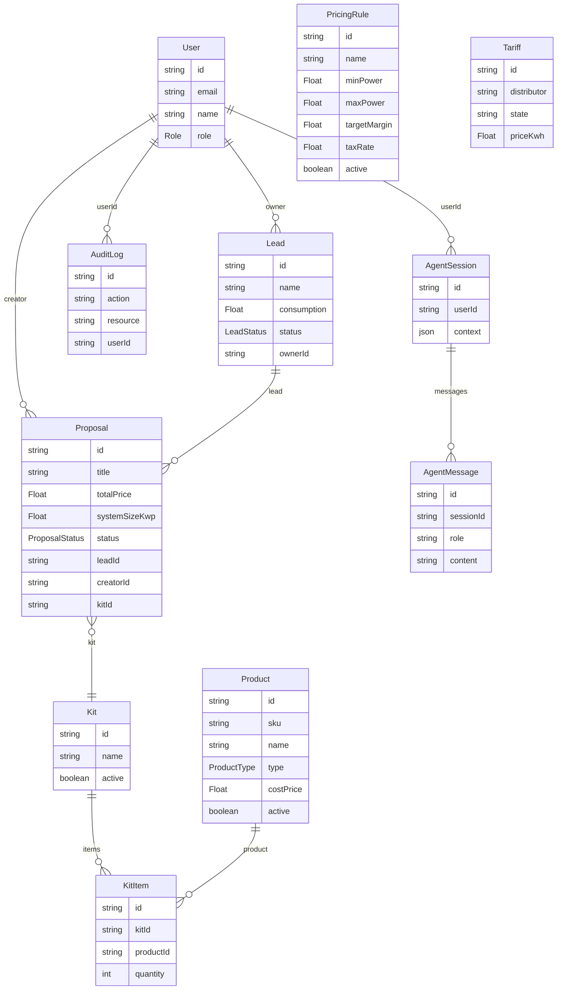
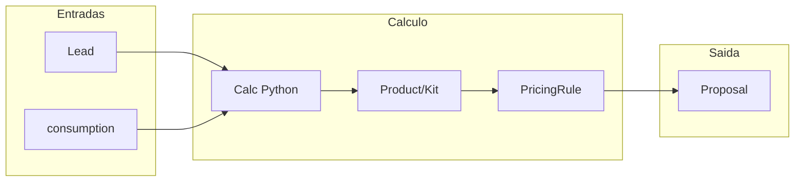
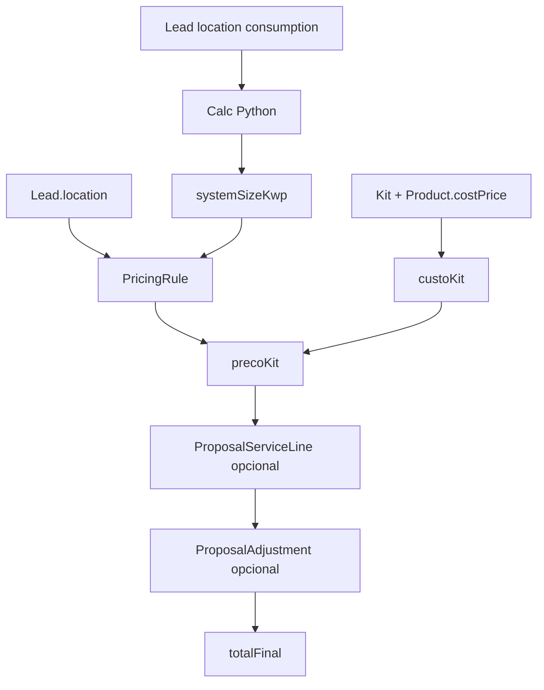

# Arquitetura de Dados — Quarks OS

**Base:** schema Prisma (`src/backend/prisma/schema.prisma`), [spec 06](specs/06-catalog-backend/spec.md), [JORNADA_E_FLUXO](JORNADA_E_FLUXO.md).  
**Atualizado:** 2026-02-03

---

## Referência rápida

| Item | Valor |
|------|--------|
| **Stack** | PostgreSQL + Prisma (backend Node); calc engine (Python); Solar API (proxy) |
| **Schema** | `src/backend/prisma/schema.prisma` |
| **Docs** | [DOMAIN_MODEL](DOMAIN_MODEL.md) · [JORNADA_E_FLUXO](JORNADA_E_FLUXO.md) · [FLUXOS_MODULOS](FLUXOS_MODULOS.md) · [spec 06](specs/06-catalog-backend/spec.md) |

---

## Sumário

1. [Visão geral](#1-visão-geral)
2. [Glossário](#2-glossário)
3. [Modelo atual (Prisma)](#3-modelo-atual-prisma)
4. [Transições de estado](#4-transições-de-estado)
5. [Mapa entidade × jornada × módulo](#5-mapa-entidade--jornada--módulo)
6. [Fluxo de dados por domínio](#6-fluxo-de-dados-por-domínio)
7. [Dados externos e não persistidos](#7-dados-externos-e-não-persistidos)
8. [Modelo futuro (planejado)](#8-modelo-futuro-planejado)
9. [Convenções e decisões](#9-convenções-e-decisões)
10. [Catálogo de serviços (planejado)](#10-catálogo-de-serviços-planejado)
11. [Precificação e formação de preços](#11-precificação-e-formação-de-preços)
12. [Riscos e decisões em aberto](#12-riscos-e-decisões-em-aberto)

---

## 1. Visão geral

Este documento é a **referência única** da arquitetura de dados do Quarks OS: modelo atual (Prisma), enums e transições, mapa entidade–jornada–módulo, dados externos, modelo futuro e planejamento de **catálogo de serviços** e **precificação**.

- **Objetivo:** Suportar implementação da spec 06 (catálogo e pricing), decisões de modelo (Client/Lead, auditoria) e escopo de ofertas.
- **Leitores:** Desenvolvedores, arquitetos, produto.

---

## 2. Glossário

| Termo | Definição |
|-------|-----------|
| **Lead** | Contato potencial (CRM); qualificação e pipeline. Ver [DOMAIN_MODEL](DOMAIN_MODEL.md) §1–2. |
| **Opportunity** | Negócio qualificado em negociação; no código hoje representado por Lead com status PROPOSAL_SENT / NEGOTIATION. |
| **Client** | Contato com negócio fechado (CLOSED_WON); entidade Client ainda não existe no schema — decisão em aberto. |
| **Proposal** | Proposta comercial solar (kit, preço, payback); vinculada a Lead e opcionalmente a Kit. |
| **Kit** | Composição de produtos (painéis, inversor, etc.); relacionado a Proposal e KitItem. |
| **KitItem** | Linha Kit–Product com quantidade (N:N). |
| **Product** | Item do catálogo (módulo, inversor, estrutura, etc.); tem costPrice. |
| **PricingRule** | Regra de margem e faixa de potência (kWp) para formação de preço. |
| **Tariff** | Tarifa por distribuidora/estado (lookup para simulação). |
| **Service** | (Planejado) Serviço do catálogo (projeto, instalação, homologação, garantia estendida). |
| **ProposalServiceLine** | (Planejado) Linha proposta × serviço (quantidade, preço unitário). |
| **Formação de preço** | Custo base (kit + serviços) × (1 + margem) / (1 − imposto); descontos aplicados após. |

---

## 3. Modelo atual (Prisma)

**Fonte:** [schema.prisma](../src/backend/prisma/schema.prisma)

### Enums

| Enum | Valores |
|------|---------|
| `Role` | INTEGRADOR, ENGENHARIA, COMERCIAL, ADMIN |
| `LeadStatus` | NEW, CONTACTED, PROPOSAL_SENT, NEGOTIATION, CLOSED_WON, CLOSED_LOST |
| `ProposalStatus` | DRAFT, SENT, VIEWED, ACCEPTED, REJECTED, EXPIRED |
| `ProductType` | MODULE, INVERTER, STRUCTURE, CABLE, OTHER |

### Modelos e relações

| Modelo | Propósito | Relações principais |
|--------|-----------|---------------------|
| User | RBAC; dono de leads, propostas, sessões | leads, proposals, auditLogs, agentSessions |
| Lead | CRM; contato potencial | owner (User), proposals |
| Proposal | Proposta comercial solar | lead, creator (User), kit (opcional) |
| Tariff | Tarifa por distribuidora/estado | — (lookup) |
| Product | Catálogo (painel, inversor, etc.) | kits via KitItem |
| Kit | Composição de produtos | items (KitItem), proposals |
| KitItem | N:N Kit–Product com quantidade | kit, product |
| PricingRule | Regras de margem e faixa de potência | — |
| AuditLog | Auditoria de ações | user |
| AgentSession | Sessão do Copilot | user, messages |
| AgentMessage | Mensagem do chat | session |

### Tabelas físicas (@@map)

| Modelo Prisma | Tabela PostgreSQL |
|---------------|-------------------|
| User | users |
| Lead | leads |
| Proposal | proposals |
| Tariff | tariffs |
| Product | products |
| Kit | kits |
| KitItem | kit_items |
| PricingRule | pricing_rules |
| AuditLog | audit_logs |
| AgentSession | agent_sessions |
| AgentMessage | agent_messages |

### Diagrama ER

---

## 4. Transições de estado

- **LeadStatus:** fluxo típico NEW → CONTACTED → PROPOSAL_SENT → NEGOTIATION → CLOSED_WON | CLOSED_LOST. Alterado por LeadDomainAgent, Kanban, webhook (cria NEW).
- **ProposalStatus:** DRAFT → SENT → VIEWED → ACCEPTED | REJECTED | EXPIRED. Alterado por ProposalDomainAgent e (futuro) fluxo de aceite.
- **Role:** usado em autorização (ex.: create-proposal exige COMERCIAL ou ADMIN); não há máquina de estados.

---

## 5. Mapa entidade × jornada × módulo

| Fase | Entidades / agentes | Referência |
|------|---------------------|------------|
| **Fase 1 — Captação/Qualificação** | Lead (LeadDomainAgent, Marketing webhook); User (ownerId) | [FLUXOS_MODULOS](FLUXOS_MODULOS.md), [JORNADA_E_FLUXO](JORNADA_E_FLUXO.md) |
| **Fase 2 — Vendas** | Lead, Proposal, Kit, Product, Tariff, PricingRule (Maestro, Calc, Product, Pricing, Proposal agents); calc engine (externo) | |
| **Fase 3 — Fechamento** | Lead (status CLOSED_*); Proposal (ACCEPTED/REJECTED). Hoje não há entidade Client | |
| **Copilot (transversal)** | AgentSession, AgentMessage; context pode referenciar Lead, Proposal (IDs em JSON) | |
| **Auth/Admin** | User, AuditLog | |

---

## 6. Fluxo de dados por domínio

- **Captação:** Webhook (FB/Google/TikTok) → adapter → Lead (create).
- **Proposta:** Lead + consumption → Calc (Python) → dimensionamento; Product (FIND_BEST_KIT) → Kit; Pricing (PricingRule) → preço; Proposal (CREATE_DRAFT).

---

## 7. Dados externos e não persistidos

- **Calc engine (Python):** entrada (consumo, distribuidora/estado, etc.); saída (kWp, geração kWh, payback, etc.). Não persiste no PostgreSQL do Node; resultado usado em memória no workflow de proposta.
- **Solar API (Google):** proxy em `GET /api/leads/:id/solar`. Dados de insight (potencial solar, irradiação) **não persistidos**; resposta em JSON (estrutura definida pelo proxy/Google). Tratar como dado externo/volátil.
- **Webhook Marketing:** payload bruto (FB/Google/TikTok) normalizado pelo adapter; apenas campos mapeados para Lead são persistidos; consumption obrigatório (default se ausente).

---

## 8. Modelo futuro (planejado)

Referência: [DOMAIN_MODEL](DOMAIN_MODEL.md) §6 e plano de jornada.

| Área | Entidades planejadas |
|------|----------------------|
| **Proposta interativa** | ProposalView (link único, expiração, evento de visualização); ProposalInteraction (aceite/recusa, comentários) |
| **Omnichannel** | Channel; Conversation (thread por lead/cliente) |
| **Projeto e instalação** | Project (vinculado a Lead/Client; status; executor); Contractor (terceirizado; SLA); Installation (data; equipe; checklist) |
| **Catálogo e proposta** | Service (ou ServiceCatalog); ProposalServiceLine — ver §10 |
| **Precificação** | Extensões em PricingRule (state, baseCostPerWp, opcional integratorId); auditoria (ProposalAdjustment ou AuditLog) — ver §11 |
| **Client** | Decisão em aberto: nova entidade Client (derivada de Lead CLOSED_WON) ou manter Lead com status e vistas/APIs separadas — ver §12 |

---

## 9. Convenções e decisões

- **IDs:** UUID (Prisma `@default(uuid())`).
- **Timestamps:** `createdAt`, `updatedAt` onde aplicável.
- **RBAC:** Role em User; rotas protegidas por role (ex.: COMERCIAL, ADMIN para create-proposal).
- **Auditoria:** AuditLog (action, resource, userId, details); uso atual conforme código.
- **Soft delete:** não uniforme; Product/Kit têm `active`.

---

## 10. Catálogo de serviços (planejado)

Além do catálogo de equipamentos, o plano prevê **catálogo de serviços**: Projeto (engenharia), Instalação, Homologação, Garantias estendidas. Fonte: [JORNADA_E_FLUXO](JORNADA_E_FLUXO.md) (Gestão refinada); ofertas customizadas com inclusão de serviços.

**Estado atual:** Prisma não possui Service nem ProposalServiceLine.

### Entidade planejada: Service

| Atributo | Tipo | Notas |
|----------|------|--------|
| id | UUID | PK |
| name | String | |
| code | String? | ou sku; integração ERP/NF |
| type | ServiceType | enum abaixo |
| basePrice | Float | |
| costPrice | Float? | opcional |
| state | String? | regra regional |
| active | Boolean | |
| validFrom | DateTime? | opcional; vigência |
| validTo | DateTime? | opcional; vigência |
| createdAt | DateTime | |
| updatedAt | DateTime | |

**Enum ServiceType (planejado):** PROJETO, INSTALACAO, HOMOLOGACAO, GARANTIA_ESTENDIDA.

### Entidade planejada: ProposalServiceLine

| Atributo | Tipo | Notas |
|----------|------|--------|
| id | UUID | PK |
| proposalId | UUID | FK Proposal |
| serviceId | UUID | FK Service |
| quantity | Int | |
| unitPrice | Float | |
| totalPrice | Float? | opcional (quantity × unitPrice) |

**Total da proposta (planejado):** kit + soma(ProposalServiceLine) + ajustes/descontos. Cross-ref: §11.

**Decisões em aberto (ver §12):** (1) Garantia estendida: por produto vs por sistema. (2) Preço de serviço: fixo global vs por estado/faixa (campo state em Service ou regra separada).

---

## 11. Precificação e formação de preços

### Estado atual (Prisma e código)

- **PricingRule:** name, minPower, maxPower, targetMargin, taxRate, active. Sem estado (UF), sem baseCostPerWp, sem vínculo a integrador. Uso em `src/backend/src/agents/pricing-domain/index.js`: findFirst por active e faixa de potência; fórmula preço = custo × (1 + margin) / (1 − tax).  
  **Nota:** [spec 06](specs/06-catalog-backend/spec.md) menciona "minMargin"; no schema atual o campo é **targetMargin**; a spec pode introduzir ou mapear minMargin.
- **Product:** costPrice (custo base do equipamento).
- **Tariff:** distributor, state, priceKwh (lookup para simulação).
- **Proposal:** totalPrice persistido; não há linhas de desconto, de serviços nem auditoria de alteração de preço.

### Planejado (spec 06 e plano de jornada)

- **PricingRule (extensões):** regras por Estado (UF), faixa de potência (min/max kWp), opcionalmente por integrador; campo fallback baseCostPerWp; refactor do PricingService para buscar regra por localização do lead e kWp do sistema.
- **Formação de preço:** custo base (kit + eventualmente serviços) + markup (margem) / (1 − imposto); variação por kWp ou faixas; múltiplas regras (primeira que bater estado + faixa).
- **Ofertas customizadas:** desconto, parcelamento, inclusão de serviços; auditoria de alterações (ProposalAdjustment ou AuditLog com resource="proposal", details JSON).
- **Fórmula (uma linha):**  
  `Preço final = (Custo_base_kit + Custo_serviços) × (1 + targetMargin) / (1 − taxRate)`  
  Descontos aplicados após (reduzem totalPrice — definir se como campo em Proposal, linha em ProposalAdjustment ou ambos). Parcelamento (parcelas, juros, valor parcela) é dado futuro — ver §12.

### Extensões sugeridas para PricingRule

| Atributo | Tipo | Notas |
|----------|------|--------|
| state | String? | UF |
| baseCostPerWp | Float? | fallback |
| integratorId | String? | opcional; multi-tenant |
| minPower | Float | manter |
| maxPower | Float | manter |
| targetMargin | Float | manter (ou minMargin na spec 06) |
| taxRate | Float | manter |

### Fluxo de precificação

---

## 12. Riscos e decisões em aberto

- **Client vs Lead:** nova entidade Client (derivada de Lead CLOSED_WON) ou manter Lead com status e vistas/APIs separadas. Ver [DOMAIN_MODEL](DOMAIN_MODEL.md) §6.
- **Auditoria de preço:** AuditLog genérico (resource=proposal, details JSON) vs tabela dedicada ProposalAdjustment (tipo, valor, userId, createdAt).
- **Service por região:** preço de serviço fixo global vs por estado/faixa (campo state em Service ou regra separada). Cross-ref §10.
- **Garantia estendida:** por produto vs por sistema; impacta modelagem de Service e ProposalServiceLine (§10).
- **Parcelamento:** definir modelo (número de parcelas, juros, valor parcela) em Proposal ou em entidade vinculada.
- **Multi-tenant (integrador):** quando introduzir múltiplos integradores, definir uso de integratorId em PricingRule (e eventualmente em Service); [spec 06](specs/06-catalog-backend/spec.md) já prevê "Integrator" em Pricing Rule.
