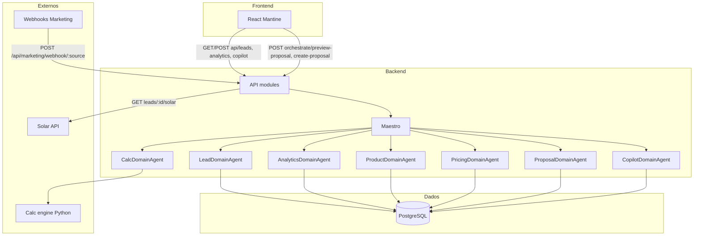

# Quarks OS — Arquitetura Técnica do Sistema

**Base:** [ARQUITETURA_DE_DADOS](ARQUITETURA_DE_DADOS.md) (modelo de dados, entidades, jornada), [FLUXOS_MODULOS](FLUXOS_MODULOS.md) (rotas e agentes), [JORNADA_E_FLUXO](JORNADA_E_FLUXO.md).  
**Atualizado:** 2026-02-03

Este documento descreve **como o sistema funciona**: camadas, fluxos por fase da jornada, uso das entidades de dados, Maestro/agentes e sistemas externos. A estrutura de dados (modelo Prisma, transições, precificação) está na [ARQUITETURA_DE_DADOS](ARQUITETURA_DE_DADOS.md).

---

## Referência rápida

| Item | Referência |
|------|------------|
| **Modelo de dados** | [ARQUITETURA_DE_DADOS](ARQUITETURA_DE_DADOS.md) §3 (modelo atual), §5 (mapa entidade×jornada), §11 (precificação) |
| **Rotas e agentes** | [FLUXOS_MODULOS](FLUXOS_MODULOS.md) |
| **Jornada e prioridades** | [JORNADA_E_FLUXO](JORNADA_E_FLUXO.md) |

---

## Sumário

1. [Visão geral](#1-visão-geral)
2. [Stack e camadas](#2-stack-e-camadas)
3. [Como o sistema funciona por fase](#3-como-o-sistema-funciona-por-fase)
4. [Transições de estado no sistema](#4-transições-de-estado-no-sistema)
5. [Maestro e agentes](#5-maestro-e-agentes)
6. [Entidade → onde é lida/escrita](#6-entidade--onde-é-lidaescrita)
7. [Sistemas e dados externos](#7-sistemas-e-dados-externos)
8. [Segurança e auditoria](#8-segurança-e-auditoria)
9. [Diagrama de arquitetura do sistema](#9-diagrama-de-arquitetura-do-sistema)
10. [Visão de evolução](#10-visão-de-evolução)
11. [Limitações e alinhamento com o backlog](#11-limitações-e-alinhamento-com-o-backlog)
12. [Referências](#12-referências)

---

## 1. Visão geral

O Quarks OS é uma aplicação para **integradores de energia solar**: captação de leads (webhooks), pipeline de vendas (CRM), proposta comercial (cálculo + kit + precificação) e Copilot IA (chat com ferramentas). O backend é modular: **Maestro** orquestra workflows e expõe **agentes por domínio** (lead, analytics, calc, product, pricing, proposal, copilot); as rotas chamam esses agentes e persistem dados via **Prisma** em **PostgreSQL**. O **calc engine (Python)** é usado em memória no fluxo de proposta e não persiste no banco do Node. Detalhes do modelo de dados, entidades e fluxos de precificação estão na [ARQUITETURA_DE_DADOS](ARQUITETURA_DE_DADOS.md).

---

## 2. Stack e camadas

| Camada | Tecnologia | Path / observação |
|--------|------------|-------------------|
| **Frontend** | React, Mantine, Recharts | `frontend/`. Consome apenas APIs (não acessa banco). |
| **Backend (Node)** | API modular, Maestro, agentes, Prisma | `src/backend/`. API: `src/backend/src/modules/`. Orquestrador: `src/backend/src/orchestrator/maestro.js`. Agentes: `src/backend/src/agents/*-domain/`. Schema: `src/backend/prisma/schema.prisma`. |
| **Calc engine (Python)** | Serviço externo (geração kWh, payback) | `src/calc_engine/`. Entrada: consumo, distribuidora/estado. Saída: kWp, geração, payback. Não persiste no PostgreSQL do Node ([ARQUITETURA_DE_DADOS](ARQUITETURA_DE_DADOS.md) §7). |
| **Dados** | PostgreSQL + Prisma | Tabelas: users, leads, proposals, products, kits, kit_items, pricing_rules, tariffs, audit_logs, agent_sessions, agent_messages. Modelo completo em [ARQUITETURA_DE_DADOS](ARQUITETURA_DE_DADOS.md) §3. |
| **Externos** | Solar API (proxy), webhooks Marketing (FB/Google/TikTok) | Solar: `GET /api/leads/:id/solar`. Webhooks: `POST /api/marketing/webhook/:source`. |

---

## 3. Como o sistema funciona por fase

Alinhado ao [mapa entidade × jornada × módulo](ARQUITETURA_DE_DADOS.md#5-mapa-entidade--jornada--módulo) (ARQUITETURA_DE_DADOS §5) e aos [fluxos de dados](ARQUITETURA_DE_DADOS.md#6-fluxo-de-dados-por-domínio) (ARQUITETURA_DE_DADOS §6).

### 3.1 Captação / Qualificação

- **Quem atua:** Webhook (ads) → adapters Marketing → Maestro `CREATE_LEAD_WORKFLOW` → LeadDomainAgent.
- **Entidades:** **Lead** (create/update), **User** (ownerId). Lead criado com status `NEW`.
- **Rotas:** `POST /api/marketing/webhook/:source` (ex.: facebook_ads, google_ads, tiktok_ads). Ver [FLUXOS_MODULOS](FLUXOS_MODULOS.md) §7 (Marketing).

### 3.2 Vendas (pipeline)

- **Quem atua:** Frontend (Kanban, lista, detalhe) ↔ API Leads ↔ LeadDomainAgent; Dashboard ↔ API Analytics ↔ AnalyticsDomainAgent.
- **Entidades:** **Lead** (read, update status); **Proposal** (leitura para agregados e timeline).
- **Rotas:** `GET /api/leads/pipeline`, `GET /api/leads/:id`, `PATCH /api/leads/:id`, `PATCH /api/leads/:id/status`, `GET /api/leads/:id/activity`; `GET /api/analytics/dashboard`, `GET /api/analytics/funnel`, `GET /api/analytics/activity`. Ver [FLUXOS_MODULOS](FLUXOS_MODULOS.md) §1–2 (Analytics, Leads).

### 3.3 Proposta (preview e criação)

- **Quem atua:** Frontend ou integração → Maestro `PREVIEW_PROPOSAL_WORKFLOW` ou `CREATE_PROPOSAL_WORKFLOW` → CalcDomainAgent → ProductDomainAgent → PricingDomainAgent → ProposalDomainAgent. Calc engine (Python) usado em memória.
- **Entidades lidas:** **Lead** (consumption, location), **Kit**, **Product**, **KitItem**, **Tariff**, **PricingRule**. **Escritas:** **Proposal** (apenas no create-proposal).
- **Fórmula de preço e fluxo:** [ARQUITETURA_DE_DADOS](ARQUITETURA_DE_DADOS.md) §11.
- **Rotas:** `POST /orchestrate/preview-proposal`, `POST /orchestrate/create-proposal` (auth: COMERCIAL ou ADMIN). Ver [FLUXOS_MODULOS](FLUXOS_MODULOS.md) §4 (Proposta).

### 3.4 Copilot (transversal)

- **Quem atua:** Frontend (Chat) → `POST /api/copilot/chat` → CopilotDomainAgent (Gemini, tools) → opcionalmente Maestro (workflows). Sessão e mensagens persistidas.
- **Entidades:** **AgentSession**, **AgentMessage** (CRUD). Context (JSON) pode referenciar Lead, Proposal (IDs).
- **Rotas:** `POST /api/copilot/chat`. Ver [FLUXOS_MODULOS](FLUXOS_MODULOS.md) §3 (Copilot).

### 3.5 Auth / Admin

- **Quem atua:** Rotas de auth; middleware de autorização em rotas protegidas (ex.: create-proposal exige COMERCIAL ou ADMIN).
- **Entidades:** **User** (login, RBAC), **AuditLog** (ação, recurso, userId). Ver [ARQUITETURA_DE_DADOS](ARQUITETURA_DE_DADOS.md) §9 (Convenções).

---

## 4. Transições de estado no sistema

Onde cada transição é disparada no código/sistema. Definições completas em [ARQUITETURA_DE_DADOS](ARQUITETURA_DE_DADOS.md) §4.

| Transição | Onde é disparada |
|-----------|-------------------|
| **LeadStatus** | Webhook Marketing → Lead criado com `NEW`. Kanban (front) → `PATCH /api/leads/:id/status` → LeadDomainAgent `UPDATE_STATUS` → CONTACTED, PROPOSAL_SENT, NEGOTIATION, CLOSED_WON, CLOSED_LOST. Create-proposal pode (conforme implementação) atualizar lead para PROPOSAL_SENT. |
| **ProposalStatus** | ProposalDomainAgent (criação → DRAFT; envio → SENT). Futuro: fluxo de aceite do cliente → VIEWED, ACCEPTED, REJECTED, EXPIRED. |
| **Role** | Usado em autorização (middleware); não há máquina de estados (User.role é atributo estático). |

---

## 5. Maestro e agentes

- **Maestro** (`src/backend/src/orchestrator/maestro.js`): orquestra workflows (`CREATE_LEAD_WORKFLOW`, `PREVIEW_PROPOSAL_WORKFLOW`, `CREATE_PROPOSAL_WORKFLOW`) e expõe agentes para as rotas (`maestro.agents['lead']`, `maestro.agents['analytics']`, etc.).

| Agente | Path | Ações principais | Entidades Prisma (ler / escrever) |
|--------|------|-------------------|------------------------------------|
| LeadDomainAgent | `src/backend/src/agents/lead-domain/index.js` | GET_PIPELINE, CREATE_LEAD, UPDATE_LEAD, UPDATE_STATUS, GET_LEAD, GET_LEAD_ACTIVITY | Lead (CRUD), User (owner) |
| AnalyticsDomainAgent | `src/backend/src/agents/analytics-domain/index.js` | GET_DASHBOARD_METRICS, GET_SALES_FUNNEL, GET_RECENT_ACTIVITY, GET_LEAD_ACTIVITY | Lead, Proposal (leitura, agregações) |
| CalcDomainAgent | `src/backend/src/agents/calc-domain/index.js` | CALCULATE_GENERATION | Invoca calc engine (Python); usa Lead/consumption; não persiste no Node |
| ProductDomainAgent | `src/backend/src/agents/product-domain/index.js` | FIND_BEST_KIT | Kit, Product, KitItem (leitura) |
| PricingDomainAgent | `src/backend/src/agents/pricing-domain/index.js` | CALCULATE_PRICE | PricingRule, Product.costPrice (leitura); fórmula em ARQUITETURA_DE_DADOS §11 |
| ProposalDomainAgent | `src/backend/src/agents/proposal-domain/index.js` | PREVIEW_HTML, CREATE_DRAFT | Proposal (create/read), Lead, Kit |
| CopilotDomainAgent | `src/backend/src/agents/copilot-domain/index.js` | CHAT | AgentSession, AgentMessage (CRUD); tools podem chamar Maestro |

---

## 6. Entidade → onde é lida/escrita

Tabela inversa para análise de impacto. Consistente com o [mapa entidade×jornada](ARQUITETURA_DE_DADOS.md#5-mapa-entidade--jornada--módulo) (ARQUITETURA_DE_DADOS §5).

| Entidade | Lida em | Escrita em |
|----------|---------|------------|
| Lead | Analytics (métricas, funnel, activity), Leads (pipeline, detalhe, activity), Proposta (create: leadId, consumption, location), Copilot (context/IDs) | Marketing (webhook → create), Leads (create, update, update status) |
| Proposal | Analytics (métricas, activity), Leads (activity/timeline), Proposta (create, preview), Copilot (context/IDs) | Proposta (create-proposal) |
| Kit | Proposta (preview, create: FIND_BEST_KIT → proposta ligada a kit) | — (hoje não há CRUD de Kit pelas rotas documentadas) |
| Product | Proposta (FIND_BEST_KIT, custo para pricing) | — (catálogo: spec 06) |
| KitItem | Proposta (composição do kit) | — |
| Tariff | Proposta (simulação; lookup distribuidora/estado) | — |
| PricingRule | Proposta (CALCULATE_PRICE) | — (spec 06: CRUD) |
| User | Auth (login), Leads (ownerId), Proposta (creatorId), autorização (role) | Auth (register) |
| AuditLog | — | Código que registra ações (conforme implementação) |
| AgentSession | Copilot (getOrCreateSession, histórico) | Copilot (create/update session) |
| AgentMessage | Copilot (histórico da sessão) | Copilot (append message) |

---

## 7. Sistemas e dados externos

- **Calc engine (Python):** Usado no fluxo de proposta (dimensionamento kWp, geração, payback). Entrada: consumo, distribuidora/estado. Saída: usada em memória pelo Maestro; não persiste no PostgreSQL do Node. Detalhes: [ARQUITETURA_DE_DADOS](ARQUITETURA_DE_DADOS.md) §7.
- **Solar API (Google):** Proxy em `GET /api/leads/:id/solar`. Dados de insight (potencial solar, irradiação) não persistidos; resposta JSON volátil. [ARQUITETURA_DE_DADOS](ARQUITETURA_DE_DADOS.md) §7.
- **Webhooks Marketing (FB/Google/TikTok):** Payload normalizado pelos adapters; apenas campos mapeados para Lead são persistidos. Consumption obrigatório (default se ausente). [ARQUITETURA_DE_DADOS](ARQUITETURA_DE_DADOS.md) §7.

---

## 8. Segurança e auditoria

- **RBAC:** Role em User (INTEGRADOR, ENGENHARIA, COMERCIAL, ADMIN). Rotas protegidas por middleware (ex.: create-proposal exige COMERCIAL ou ADMIN). [ARQUITETURA_DE_DADOS](ARQUITETURA_DE_DADOS.md) §9.
- **Auditoria:** AuditLog (action, resource, userId, details). Uso atual conforme código. Modelo futuro para auditoria de preço (ProposalAdjustment vs AuditLog) em [ARQUITETURA_DE_DADOS](ARQUITETURA_DE_DADOS.md) §12.

---

## 9. Diagrama de arquitetura do sistema

Fluxos principais: usuário/evento → Frontend ou Webhook → Backend (API + Maestro) → Agentes → PostgreSQL; Calc engine e Solar API como externos.

---

## 10. Visão de evolução

Com base no [modelo futuro](ARQUITETURA_DE_DADOS.md#8-modelo-futuro-planejado) da ARQUITETURA_DE_DADOS §8, onde os conceitos entrariam na arquitetura atual (sem implementar; apenas direção):

| Conceito | Onde entraria |
|----------|----------------|
| **Service, ProposalServiceLine** | Novos endpoints (ex.: CRUD Service, linhas na proposta); extensão do ProposalDomainAgent ou novo agente; fluxo de precificação estendido (ARQUITETURA_DE_DADOS §10–11). |
| **Client** | Nova entidade e rotas (ex.: `/api/clients`) ou vistas/APIs filtradas sobre Lead (status CLOSED_WON). Decisão em ARQUITETURA_DE_DADOS §12. |
| **ProposalView, ProposalInteraction** | Novos endpoints (link único, aceite/recusa); extensão do ProposalDomainAgent; possivelmente fluxo Maestro para "enviar proposta" e "registrar visualização/aceite". |
| **Project, Contractor, Installation** | Novos módulos/agentes (ex.: ProjectDomainAgent); rotas de projeto e instalação; fase pós-fechamento (JORNADA_E_FLUXO). |
| **Channel, Conversation** | Omnichannel: novos módulos e persistência de conversas por lead/cliente. |
| **PricingRule (extensões), auditoria de preço** | Spec 06: CRUD PricingRule; refactor PricingDomainAgent; ProposalAdjustment ou AuditLog para alterações de preço (ARQUITETURA_DE_DADOS §11–12). |

---

## 11. Limitações e alinhamento com o backlog

Limitações atuais do sistema documentadas no backlog e nas decisões em aberto:

- **Dashboard:** KPIs e métricas ainda com dados estáticos em parte do frontend; conectar totalmente à API ou rotular como exemplo. Ver [O_QUE_FALTA](O_QUE_FALTA.md) §1 (Dashboard).
- **Webhook Marketing:** Rota `POST /api/marketing/webhook/:source`; consumption default (500 kWh) e city→location nos adapters; payload restrito ao schema Lead. Ver [FLUXOS_MODULOS](FLUXOS_MODULOS.md) §7.
- **Client:** Entidade Client não existe; fechados são Lead com status CLOSED_WON. Decisão em [ARQUITETURA_DE_DADOS](ARQUITETURA_DE_DADOS.md) §12.
- **Auditoria de preço:** Não implementada (ProposalAdjustment ou uso de AuditLog para alterações de preço/desconto). [ARQUITETURA_DE_DADOS](ARQUITETURA_DE_DADOS.md) §12.
- **Catálogo e pricing:** CRUD de Product/Kit/PricingRule e Pricing Service refactor previstos na spec 06; hoje proposta usa regras e catálogo existentes. Ver [O_QUE_FALTA](O_QUE_FALTA.md), [ARQUITETURA_DE_DADOS](ARQUITETURA_DE_DADOS.md) §10–11.

---

## 12. Referências

- [ARQUITETURA_DE_DADOS](ARQUITETURA_DE_DADOS.md) — Modelo de dados atual e planejado; Prisma; serviços; precificação; diagramas ER e fluxo; riscos e decisões.
- [FLUXOS_MODULOS](FLUXOS_MODULOS.md) — Fluxo de dados por módulo; rotas backend; ações e entidades por rota.
- [JORNADA_E_FLUXO](JORNADA_E_FLUXO.md) — Índice da jornada, rotas estratégicas e prioridades.
- [DOMAIN_MODEL](DOMAIN_MODEL.md) — Lead, Opportunity, Client; nicho e perfis de usuário.
- [O_QUE_FALTA](O_QUE_FALTA.md) — Backlog; gaps por fase; prioridades; roadmap.
- [specs/06-catalog-backend/spec.md](../specs/06-catalog-backend/spec.md) — Catálogo e pricing (CRUD Product, Kit, PricingRule; refactor PricingService).
