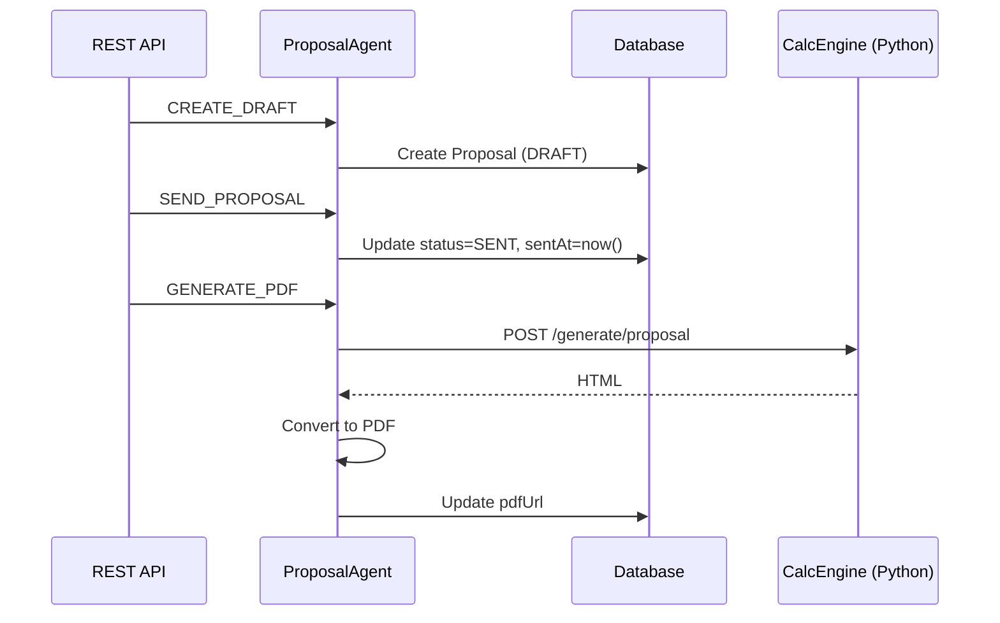

# Implementation Plan: Backend Proposal Engine

**Branch**: `07-proposal-engine` | **Date**: 2026-02-03 | **Spec**: [spec.md](./spec.md)

## Summary

Expandir ProposalDomainAgent com CRUD completo e workflow de status (DRAFT → SENT → VIEWED → ACCEPTED/REJECTED). Criar APIs REST e integração com geração de PDF.

## Technical Context

**Language/Version**: Node.js 18+, Python 3.11+ (calc_engine)
**Primary Dependencies**: Prisma, Express, Axios
**Storage**: PostgreSQL (Proposal model existente)
**Testing**: Manual API verification via curl
**Target Platform**: Web API
**Project Type**: Backend module extension
**Constraints**: Manter compatibilidade com workflow existente do Maestro

## Constitution Check

- **P1 (Python-First)**: Cálculos em Python (calc_engine), orquestração em Node. PASS.
- **P2 (Backend-First)**: Foco apenas em APIs, sem UI. PASS.
- **P3 (Spec-Driven)**: spec.md, plan.md, tasks.md presentes. PASS.
- **P4 (Ironclad Anti-Regression)**: Manter CREATE_DRAFT existente. PASS.

## Project Structure

### Source Code

```text
src/backend/src/
├── modules/
│   └── proposals/        # [NEW] Proposals REST API
│       └── routes.js
├── agents/
│   └── proposal-domain/
│       └── index.js      # [MODIFY] Add CRUD and workflow actions
└── orchestrator/
    └── maestro.js        # [MODIFY] Register proposal workflow if needed
```

### Database Schema Changes

```prisma
model Proposal {
  // Existing fields...
  
  // [NEW] Workflow fields
  discountPercent   Float?
  notes             String?   @db.Text
  version           Int       @default(1)
  sentAt            DateTime?
  viewedAt          DateTime?
  acceptedAt        DateTime?
  rejectedAt        DateTime?
  rejectionReason   String?
}
```

## Data Flow



## Dependencies

- **06-catalog-backend** ✅: Provides Kits and Pricing
- **calc_engine**: Provides generation, ROI, tariff calculations
- **Prisma schema**: Must add new fields before implementation

## Phases

1. **Schema Update**: Add new Proposal fields
2. **CRUD Routes**: Create REST endpoints
3. **Proposal Agent**: Add new actions
4. **Workflow**: Status transitions
5. **PDF Generation**: Integrate with calc_engine
6. **Testing**: Verify all endpoints
